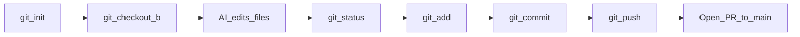

# Git Basics for AI-Assisted Development

When you work with AI coding assistants, changes come fast — new files appear, refactors span dozens of files, and not every suggestion is correct. Git gives you a safety net: every saved snapshot is a restore point you can review, share, or undo.

This guide covers six essential commands in the order you'll use them day to day:

**branch → edit → status → add → commit → push**

Four habits make AI-assisted development safer:

- **Small commits** — easier to review, revert, and bisect
- **Feature branches** — isolate AI experiments from stable code
- **Avoid direct changes to main** — keep `main` deployable; mistakes stay on branches
- **Rollback safety** — every commit is a restore point



## Recommended Workflow

Before diving into individual commands, here is the daily loop:

1. Start from an updated `main`, then create a feature branch.
2. Let the AI make changes in small batches — not one giant session.
3. Review with `git status` and `git diff` before staging anything.
4. Commit logical units of work as you go.
5. Push your branch and open a pull request — never push experimental AI work directly to `main`.

End-to-end example:

```bash
git checkout main
git pull
git checkout -b feature/add-login-validation
# ... AI makes changes ...
git status
git add src/auth/login.ts
git commit -m "Add login form validation"
git push -u origin feature/add-login-validation
```

---

## Command Reference

### `git init`

**What it does**

Creates a new local Git repository in the current directory. Git adds a hidden `.git/` folder that tracks every change from this point forward.

**Why it matters for AI-assisted development**

Without `git init`, there is no history and no rollback. AI agents can modify or delete files freely — version control is what lets you recover when something goes wrong. Run this once at the start of any project before handing control to an assistant.

**Example**

```bash
git init
```

---

### `git status`

**What it does**

Shows which files are modified, staged, or untracked, and which branch you are currently on. It is your map of what changed since the last commit.

**Why it matters for AI-assisted development**

After an AI session, always run `git status` before committing. Agents sometimes create unexpected files, delete things you did not ask for, or touch files outside the scope of your task. Status is your first sanity check — catch surprises before they become permanent.

**Example**

```bash
git status
```

---

### `git checkout -b <branch-name>`

**What it does**

Creates a new branch and switches to it in one step. You leave `main` untouched and do all your work on the new branch.

**Why it matters for AI-assisted development**

AI refactors can go sideways — wrong abstractions, broken tests, files you did not intend to change. Working on a feature branch means a bad session costs you a branch delete, not a painful untangle of `main`. If the experiment fails, abandon the branch and start fresh.

> **Note:** Modern Git also offers `git switch -c <branch-name>` as an equivalent. Both work; this guide uses `checkout -b` because it is widely recognized.

**Example**

```bash
git checkout -b feature/add-user-auth
```

---

### `git add`

**What it does**

Stages changes — marks specific files (or all changes) as ready for the next commit. Nothing is saved permanently until you commit.

**Why it matters for AI-assisted development**

AI agents often touch many files at once. Use `git add` to commit in **small slices** — stage only the files you have reviewed, not everything the agent changed in one shot. Prefer naming files explicitly over `git add .` when an agent has been busy.

**Example**

```bash
git add src/auth/login.ts
```

---

### `git commit`

**What it does**

Saves a snapshot of everything currently staged, along with a message describing what changed. Each commit gets a unique ID you can return to later.

**Why it matters for AI-assisted development**

Every commit is a rollback point. When AI output is wrong, a small, focused commit lets you `git revert` just that change instead of undoing an entire session. Commit after each reviewed batch — not once at the end of a long agent run.

**Example**

```bash
git commit -m "Add login form validation"
```

---

### `git push`

**What it does**

Uploads your local commits to a remote repository (such as GitHub). After the first push with `-u`, Git remembers the upstream branch for future pushes.

**Why it matters for AI-assisted development**

Pushing backs up your work and opens the door to pull request review before anything reaches `main`. Never push unreviewed AI experiments directly to `main` — push your feature branch and merge through a PR instead.

**Example**

```bash
git push -u origin feature/add-user-auth
```

---

## Best Practices

### Small commits

- One logical change per commit — a single fix, one new function, one doc update.
- Commit after each reviewed AI batch, not at the end of a long session.
- Write messages that explain *why*, not just *what*.

Good commit messages:

```
Add email format validation to login form
Fix off-by-one error in pagination helper
Extract auth logic into reusable service
```

Bad commit messages:

```
AI changes
Fix stuff
WIP
Update files
```

### Feature branches

- Use a naming prefix: `feature/`, `fix/`, or `docs/`.
- One branch per task or pull request — do not pile unrelated AI experiments onto the same branch.
- Delete the branch after it is merged; stale branches clutter the repo and cause confusion.

Examples:

```
feature/add-user-auth
fix/null-check-in-parser
docs/git-basics-guide
```

### Avoid direct changes to main

- Rule of thumb: AI agents should always work on a branch, never directly on `main`.
- Enable branch protection on your remote (GitHub, GitLab, etc.) so `main` requires a PR and passing checks before merge.
- If production needs an urgent fix, use a `hotfix/` branch — still not a direct commit to `main`.

### Rollback safety

- Use `git log --oneline` to find the commit you want to undo.
- Prefer `git revert <commit>` over `git reset` on shared branches — revert creates a new commit that undoes the change without rewriting history.
- Small commits make rollback surgical: reverting one bad AI suggestion does not undo everything else you did that day.

```bash
git log --oneline
# abc1234 Add login form validation
# def5678 Add auth service scaffold

git revert abc1234   # safely undo just the validation commit
```

---

## Quick Reference

| Command | Purpose |
|---------|---------|
| `git init` | Create a new local repository |
| `git status` | See modified, staged, and untracked files |
| `git checkout -b <name>` | Create and switch to a new branch |
| `git add <file>` | Stage specific changes for commit |
| `git commit -m "<message>"` | Save a snapshot of staged changes |
| `git push -u origin <branch>` | Upload commits to the remote repository |

---

## Common AI-Assisted Pitfalls

- **Committing without checking status** — agents create junk files, duplicate helpers, or touch configs you did not expect. Always run `git status` first.
- **One giant "AI did everything" commit** — impossible to review, impossible to revert cleanly. Break work into small commits as you go.
- **Pushing unreviewed changes to `main`** — a bad AI session on `main` affects everyone. Use feature branches and pull requests.
- **Forgetting to branch before starting** — if you are already on `main` when the agent starts editing, stop, stash or discard, create a branch, then continue.
